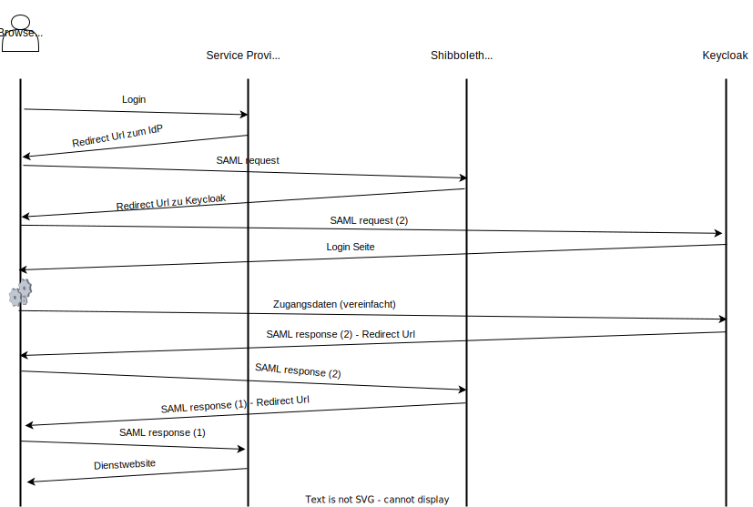

# Shibboleth IdP

Zusätzlich zu Keycloak verwenden wir für per SAML angebundene Dienste den Shibboleth Identity Provider. Während für per OIDC angebundene Dienste und weitere Funktionen wie MFA, grafische Verwaltung, usw. Keycloak gut geeignet ist, unterstützt er keine einfache Integration in SAML-Föderationen wie die DFN AAI. Damit ist das einfache Anbinden von Diensten, die der gesamten DFN AAI oder EduGain zur Verfügung gestellt werden (z.B. diverse Verlagsdienste, BW IdM Dienste wie bwsyncandshare, ...) nur unter erhöhtem Aufwand und manueller Nacharbeit möglich. Aus diesem Grund wird für diese Dienste der Shibboleth Identity Provider weiterhin verwendet. 

Um den Nutzern ein einheitliches und einfaches Nutzungserlebnis zu bieten, soll der Login an diesen Diensten über das zentrale Login-Portal (Keycloak) erfolgen und der IdP keine eigene Login-Maske anzeigen. Aus diesem Grund wird der Shibboleth IdP als Proxy zum Keycloak verwendet und lediglich die Consent-Seite des IdPs angezeigt.

## Ablauf



Die Authentifierung über den IdP und Keycloak sind technisch 2 Authentifizierungsvorgänge:

1. Shibboleth IdP meldet sich als SP bei Keycloak an (Shibboleth IdP ist SP)
2. Dienst meldet sich als SP bei Shibboleth IdP an (Shibboleth IdP ist IdP)

Durch die Umleitungen im Browser bemerkt der Nutzer in der Regel nicht, dass die Anmeldung über den Shibboleth IdP stattfindet. Dadurch, dass er meist über Keycloak angemeldet ist, entfällt die grafische Anmeldung für den Dienst und das Nutzererlebnis ist in der Regel besser.

## Entscheidungen
Wir verwenden den Proxy ausschließlich dafür, die NameID = den Benutzernamen zu übertragen. Sämtliche Attribute, die der Shibboleth IdP an andere SPs zurückgibt, werden anhand der NameID aus anderen Datenquellen, z.B. LDAP, extrahiert. Dies ermöglicht eine einfache Umstellung und die einfache Unterstützung von SPs mit Spezialwünschen (z.B. aufgrund Datenschutzrechtlicher Vorgaben).

## Einrichtung
Nachfolgend wird davon ausgegangen, dass der Shibboleth IdP entsprechend der Anleitung der DFN AAI konfiguriert ist, siehe [hier](https://doku.tid.dfn.de/de:shibidp:uebersicht). Hinweis: Wir haben für unsere Einrichtung den Shibboleth IdP in Version 4 verwendet. Das Tutorial auf der Dokumentationsseite der DFN AAI bezieht sich zum Zeitpunkt der Einstellung des Artikels auf Version 4; aktuell ist Version 5; konzeptionell und technisch sollten die nachfolgenden Hinweise anwendbar sein - von Seiten der Hochschule Heilbronn wurde dies noch nicht überprüft.

### Relevante Dokumentation
- [Using SAML Proxying to another IdP](https://shibboleth.atlassian.net/wiki/spaces/KB/pages/1459979597/Using+SAML+Proxying+to+another+IdP), beschreibt das konzeptionelle Vorgehen, ist aber out of date
- [Using SAML Proxying in the Shibboleth IdP to connect with Azure AD](https://shibboleth.atlassian.net/wiki/spaces/KB/pages/1467056889/Using+SAML+Proxying+in+the+Shibboleth+IdP+to+connect+with+Azure+AD), wie oben, deutlich ausführlicher und als Lektüre empfohlen, leider auch out of date
- [SAMLAuthnConfiguration](https://shibboleth.atlassian.net/wiki/spaces/IDP4/pages/1282539600/SAMLAuthnConfiguration), beschreibt die Konfiguration der Komponente, die die meisten Änderungen benötigt.

### Umsetzung
Warnung: Wenn ein Shibboleth IdP nicht neu eingerichtet wird, sondern mehrfach upgeraded wurde, befinden sich die relevanten Konfigurationsoptionen eventuell in anderen Dateien und überschreiben die Konfiguration, die frisch angepasst wurde!

Bitte stellen Sie vor sämtlichen Änderungen sicher, dass der Shibboleth IdP wie erwartet mit "klassischer Anmeldung" mit Benutzername / Passwort funktioniert und erstellen Sie ein Backup sämtlicher Konfigurationsdateien.

Die genannten Urls müssen selbstverständlich durch eigene Urls ausgetauscht werden.


1. Umstellung des Authn-Flows

```
idp.authn.flows = SAML
```

in conf/authn/authn.properties und/oder conf/idp.properties

2. Metadaten eintragen
Shibboleth IdP benötigt die Metadaten von Keycloak. Dazu in der Datei metadata-provider.xml folgendes ergänzen:

```xml
        <MetadataProvider id="login.hs-heilbronn.de"
                xsi:type="FilesystemMetadataProvider"
                metadataFile="%{idp.home}/metadata/idp_login.hs-heilbronn.de_metadata.xml">
        </MetadataProvider>
```

Im Anschluss muss die entsprechende Datei angelegt werden. Der Inhalt entspricht dabei dem SAML-Descriptor von Keycloak unter https://login.hs-heilbronn.de/realms/hhn/protocol/saml/descriptor.

3. Client in Keycloak anlegen
In Keycloak muss ein neuer SAML2 Client angelegt werden, die EntityID / die Client-ID entspricht dabei der EntityId des Shibboleth IdP. Unter Advanced muss die Assertion Consumer Service POST Binding URL auf `https://idp.hs-heilbronn.de/idp/profile/Authn/SAML2/POST/SSO` gesetzt werden.
Das NameID-Format wird dabei auf `username` gesetzt, Force POST Binding aktiviert und Include AuthnStatement ebenfalls aktiviert. Sign documents und sign assertions werden ebenfalls aktiviert (benötigt der Shibboleth IdP in seinen Standardeinstellungen).

4. conf/c14n/subject-c14n.xml anpassen

- `<ref bean="c14n/SAML2ProxyTransform" />` muss einkommentiert / aktiviert werden.
- Das NameId-Mapping von Keycloak-Seite aus muss aktiviert werden:

```xml
    <bean id="shibboleth.ProxyNameTransformPredicate" parent="shibboleth.Conditions.ProxyAuthentication">
        <constructor-arg name="collection">
            <list>
                <value>https://login.hs-heilbronn.de/realms/hhn</value>

            </list>
        </constructor-arg>
    </bean>
```

<details>
<summary>
Gesamter Dateiinhalt conf/c14n/subject-c14n.xml
</summary>

```xml
<?xml version="1.0" encoding="UTF-8"?>
<beans xmlns="http://www.springframework.org/schema/beans"
       xmlns:context="http://www.springframework.org/schema/context"
       xmlns:util="http://www.springframework.org/schema/util"
       xmlns:p="http://www.springframework.org/schema/p"
       xmlns:c="http://www.springframework.org/schema/c"
       xmlns:xsi="http://www.w3.org/2001/XMLSchema-instance"
       xsi:schemaLocation="http://www.springframework.org/schema/beans http://www.springframework.org/schema/beans/spring-beans.xsd
                           http://www.springframework.org/schema/context http://www.springframework.org/schema/context/spring-context.xsd
                           http://www.springframework.org/schema/util http://www.springframework.org/schema/util/spring-util.xsd"

       default-init-method="initialize"
       default-destroy-method="destroy">
    
    <!-- ========================= Java Subject -> Principal Mapping ========================= -->

    <!--
    These are lists of Subject Canonicalization flows that turn complex Subject data into a string-based
    principal name that the rest of the IdP can operate on. They're used both after authentication and
    during operations like SAML attribute queries, to map the SAML Subject into a principal name. 
    Flows are identified with an ID that corresponds to a Spring Web Flow subflow name.
    -->

    <!-- Flows used after authentication to produce canonical principal name. -->
    <util:list id="shibboleth.PostLoginSubjectCanonicalizationFlows">
        <!--
        This is an advanced post-login step that performs attribute resolution and then produces a username
        from an attribute value. Most of this configuration is handled by attribute-sourced-c14n-config.xml.
        To enable universally, just uncomment, but if you want it to run under more specific conditions,
        set an activationCondition property to a condition function to use to control when it should run. 
        -->
        <!-- <bean id="c14n/attribute" parent="shibboleth.PostLoginSubjectCanonicalizationFlow" /> -->

        <!--
        This is an advanced option for use with SAML 2 proxy authentication to a second IdP that
        derives the principal name semi-directly from the incoming NameID value. It is functionally
        akin to the c14n/SAML2Transform flow for SAML Request scenarios, but separately defined so
        a suitably restrictive format list and/or condition can be applied to it. 
        -->
        <ref bean="c14n/SAML2ProxyTransform" />

        <!--
        This is an alternative that handles Subjects containing an X500Principal object and
        allows extraction from the DN.
        -->
        <ref bean="c14n/x500" />

        <!--
        This is the standard post-login step that returns a username derived from the login process. If you
        have more complex needs such as mapping a certificate DN into a principal name, an alternative may
        be required such as that above, but you can configure simple transforms in simple-subject-c14n-config.xml
        -->
        <ref bean="c14n/simple" />
    </util:list>

    <!-- What SAML NameID formats do you want to support direct transformations for while proxying? -->
    <util:list id="shibboleth.ProxyNameTransformFormats">
        <value>urn:oasis:names:tc:SAML:1.1:nameid-format:unspecified</value>
        <value>urn:oasis:names:tc:SAML:1.1:nameid-format:emailAddress</value>
        <value>urn:oasis:names:tc:SAML:1.1:nameid-format:X509SubjectName</value>
        <value>urn:oasis:names:tc:SAML:1.1:nameid-format:WindowsDomainQualifiedName</value>
        <value>urn:oasis:names:tc:SAML:2.0:nameid-format:kerberos</value>
    </util:list>


    <!--
    Under what conditions should direct NameID mapping during proxying be allowed? By default, never.
    Any condition can be used here; the example is suitable for enumerating a number of IdPs to allow.
    -->
    <bean id="shibboleth.ProxyNameTransformPredicate" parent="shibboleth.Conditions.ProxyAuthentication">
        <constructor-arg name="collection">
            <list>
                <value>https://login.hs-heilbronn.de/realms/hhn</value>

            </list>
        </constructor-arg>
    </bean>

    <util:list id="shibboleth.ProxyNameTransforms">
        <!--
        <bean parent="shibboleth.Pair" p:first="^(.+)@example\.org$" p:second="$1" />
        -->
    </util:list>

   
    <!--
    Flows used during SAML requests to reverse-map NameIdentifiers/NameIDs. The actual beans defining these
    flows are in a system file. Below the list are some settings that might be useful to adjust.
    -->
    <util:list id="shibboleth.SAMLSubjectCanonicalizationFlows">

        <!--
        This is installed to support the old mechanism of using PrincipalConnectors in the attribute resolver
        to map SAML Subjects back into principals. If you don't use those (or this is a new install) you can
        remove this.
        -->
	<!--<ref bean="c14n/LegacyPrincipalConnector" /> -->
        
        <!-- The next four are for handling transient IDs (in-storage and stateless variants). -->
        <ref bean="c14n/SAML2Transient" />
        <ref bean="c14n/SAML2CryptoTransient" />
        <ref bean="c14n/SAML1Transient" /> 
        <ref bean="c14n/SAML1CryptoTransient" /> 
        
        <!-- Handle a SAML 2 persistent ID, provided a stored strategy is in use. -->
        <ref bean="c14n/SAML2Persistent" />
        
        <!--
        Finally we have beans for decoding arbitrary SAML formats directly. By default, these are turned off,
        having *no* circumstances for which they apply (see shibboleth.TransformNamePredicate below).
        -->
        <ref bean="c14n/SAML2Transform" />
        <ref bean="c14n/SAML1Transform" />
    </util:list>
    
    <!-- What SAML NameID formats do you want to support direct transformations for? -->
    <util:list id="shibboleth.NameTransformFormats">
        <value>urn:oasis:names:tc:SAML:1.1:nameid-format:unspecified</value>
        <value>urn:oasis:names:tc:SAML:1.1:nameid-format:emailAddress</value>
        <value>urn:oasis:names:tc:SAML:1.1:nameid-format:X509SubjectName</value>
        <value>urn:oasis:names:tc:SAML:1.1:nameid-format:WindowsDomainQualifiedName</value>
        <value>urn:oasis:names:tc:SAML:2.0:nameid-format:kerberos</value>
    </util:list>

    <!--
    Under what conditions should direct NameID mapping be allowed? By default, never.
    Any condition can be used here; the example is suitable for enumerating a number of SPs to allow.
    -->
    <bean id="shibboleth.NameTransformPredicate" parent="shibboleth.Conditions.RelyingPartyId">
        <constructor-arg name="candidates">
            <list>
                <!-- <value>https://sp.example.org</value> -->
            </list>
        </constructor-arg>
    </bean>
    
    <!--
    Regular expression transforms to apply to incoming subject names. The default empty list just
    echoes the name through unmodified.
    -->
    <util:list id="shibboleth.NameTransforms">
        <!--
        <bean parent="shibboleth.Pair" p:first="^(.+)@example\.edu$" p:second="$1" />
        -->
    </util:list>
    
</beans>
```
</details>

