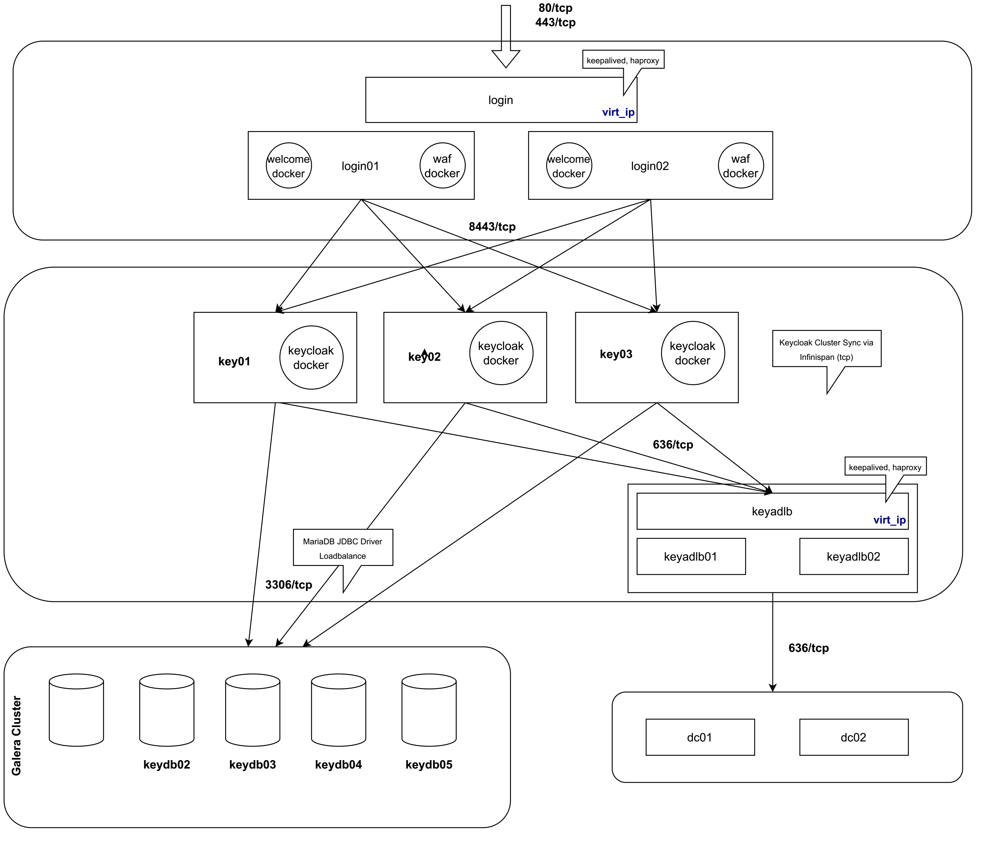

## Technische Architektur

### Überblick

Als neue zentrale Login-Infrastruktur handelt es sich bei unserem Deployment um ein
hochverfügbares Keycloak-Cluster bestehend aus mehreren Komponenten und Erweiterungen,
die im Nachfolgenden näher beschrieben werden.



Die Kommunikation zwischen den einzelnen Netz-Segmenten und Komponenten erfolgt immer verschlüsselt.

### Login Portal

Keycloak wird an der Hochschule Heilbronn hinter einem 2-Knoten [HAProxy](https://www.haproxy.org/) über eine virtuelle IP Adresse via [keepalived](https://www.keepalived.org/) bereitgestellt.
Einer der beiden Knoten befindet sich dabei im Standby.

Zusätzlich dazu sind in jeweils einem [Docker](https://www.docker.com/)-Container der zuvor erwähnte Erst-Einrichtungsassistent
sowie eine [Web Application Firewall](https://github.com/jcmoraisjr/modsecurity-spoa) (ebenfalls als Docker-Container) hinterlegt.

Der HAProxy ist zudem für [URL-basiertes Rate-Limitting](https://www.haproxy.com/blog/four-examples-of-haproxy-rate-limiting) konfiguriert,
um Zugriffe auf den `authenticate` Endpunkt von Keycloak im Ernstfall zu throtteln.

### Keycloak

Die Hochschule betreibt einen Verbund aus drei Keycloak-Knoten, die als Docker-Container auf den jeweiligen virtuellen Maschinen betrieben werden.
Die Cluster-Synchronisation zwischen den einzelnen Knoten erfolgt (abweichend von einer Standard-Installation) über verschlüsselte **tcp** (sonst **udp**) Infinispan-Kommunikation.

#### Infinispan Config

```xml
<infinispan
        xmlns:xsi="http://www.w3.org/2001/XMLSchema-instance"
        xsi:schemaLocation="urn:infinispan:config:11.0 http://www.infinispan.org/schemas/infinispan-config-11.0.xsd"
        xmlns="urn:infinispan:config:11.0">

<!-- Adjusting transport stack to use encrypted traffic -->

<jgroups>
    <stack name="my-encrypt-tcp" extends="tcp">
    <SSL_KEY_EXCHANGE keystore_name="/opt/keycloak/conf/server.jks"
        keystore_password="MY_KEYSTORE_PASSWORD"
        stack.combine="INSERT_AFTER"
        stack.position="VERIFY_SUSPECT2"/>
        <ASYM_ENCRYPT asym_keylength="2048"
        asym_algorithm="RSA"
        change_key_on_coord_leave = "false"
        change_key_on_leave = "false"
        use_external_key_exchange = "true"
        stack.combine="INSERT_BEFORE"
        stack.position="pbcast.NAKACK2"/>
    </stack>
</jgroups>


    <cache-container name="keycloak">
        <transport lock-timeout="60000" stack="my-encrypt-tcp"/>
        <local-cache name="realms">
            <encoding>
                <key media-type="application/x-java-object"/>
                <value media-type="application/x-java-object"/>
            </encoding>
            <memory max-count="10000"/>
        </local-cache>
        <local-cache name="users">
            <encoding>
                <key media-type="application/x-java-object"/>
                <value media-type="application/x-java-object"/>
            </encoding>
            <memory max-count="10000"/>
        </local-cache>
        <distributed-cache name="sessions" owners="2">
            <expiration lifespan="-1"/>
        </distributed-cache>
        <distributed-cache name="authenticationSessions" owners="2">
            <expiration lifespan="-1"/>
        </distributed-cache>
        <distributed-cache name="offlineSessions" owners="2">
            <expiration lifespan="-1"/>
        </distributed-cache>
        <distributed-cache name="clientSessions" owners="2">
            <expiration lifespan="-1"/>
        </distributed-cache>
        <distributed-cache name="offlineClientSessions" owners="2">
            <expiration lifespan="-1"/>
        </distributed-cache>
        <distributed-cache name="loginFailures" owners="2">
            <expiration lifespan="-1"/>
        </distributed-cache>
        <local-cache name="authorization">
            <encoding>
                <key media-type="application/x-java-object"/>
                <value media-type="application/x-java-object"/>
            </encoding>
            <memory max-count="10000"/>
        </local-cache>
        <replicated-cache name="work">
            <expiration lifespan="-1"/>
        </replicated-cache>
        <local-cache name="keys">
            <encoding>
                <key media-type="application/x-java-object"/>
                <value media-type="application/x-java-object"/>
            </encoding>
            <expiration max-idle="3600000"/>
            <memory max-count="1000"/>
        </local-cache>
        <distributed-cache name="actionTokens" owners="2">
            <encoding>
                <key media-type="application/x-java-object"/>
                <value media-type="application/x-java-object"/>
            </encoding>
            <expiration max-idle="-1" lifespan="-1" interval="300000"/>
            <memory max-count="-1"/>
        </distributed-cache>
    </cache-container>
</infinispan>

```

#### Dockerfile

Neben der oben erwähnten Anpassung an der Cluster-Kommunikation müssen noch andere Anpassungen für den produktiven Betrieb vorgenommen werden.
Unter anderem müssen die entsprechenden Zertifikate für verschlüsselte Kommunikation hinzugefügt werden und entsprechende Konfiguration für den
Betrieb hinter einem HAProxy gesetzt werden.

Da im Falle der Hochschule Heilbronn für die Mitarbeitenden der Verwaltung zudem Client-Zertifkate zur Authentifikation eingesetzt werden sollen,
müssen auch für diesen Sonderfall Einstellungen am Keycloak-Container (und am HAProxy) vorgenommen werden.

```dockerfile
# We pin a specific version here, so needs to be changed if Keycloak is updated
FROM quay.io/keycloak/keycloak:22.0.3 as builder

# Enable health and metrics support
ENV KC_HEALTH_ENABLED=true
ENV KC_METRICS_ENABLED=true

# Configure a database vendor
ENV KC_DB=mariadb

WORKDIR /opt/keycloak

COPY hhn-ad-ca-cert.pem /hhn-ad-ca-cert.pem
COPY hhn-ad-lb-cert.pem /hhn-ad-lb-cert.pem
COPY hhn-galera-ca-cert.pem /hhn-galera-ca-cert.pem

# Copy custom infinispan configuration to build container (encrypted traffic)
COPY hhn-infinispan-config.xml /opt/keycloak/conf/hhn-infinispan-config.xml

# Update certificate store with CA certs for HHN RZ Active Directory and HHN RZ Galera Cluster
USER root
# Import CA Certificate of HHN RZ Active Directory
RUN keytool -import -keystore /etc/pki/java/cacerts -alias hhn-ad-ca-cert -file /hhn-ad-ca-cert.pem -noprompt -storepass changeit
# Import CA Certificate of HHN RZ Active Directory Proxy Loadbalancer
RUN keytool -import -keystore /etc/pki/java/cacerts -alias hhn-ad-lb-cert -file /hhn-ad-lb-cert.pem -noprompt -storepass changeit
# Import CA Certificate of HHN RZ Galera Cluster
RUN keytool -import -keystore /etc/pki/java/cacerts -alias hhn-galera-ca-cert -file /hhn-galera-ca-cert.pem -noprompt -storepass changeit

# Switch back to the build user
USER keycloak 

# Add hhn theme
COPY hhn-theme.jar /opt/keycloak/providers/hhn.jar
# Build keycloak with preview features required for HHN Auth
RUN ls -la /opt/keycloak && /opt/keycloak/bin/kc.sh build \
--features=declarative-user-profile,admin-fine-grained-authz,recovery-codes \
--transaction-xa-enabled=false \
--spi-theme-welcome-theme=hhn \
--cache=ispn \ 
--cache-config-file=hhn-infinispan-config.xml \
--spi-x509cert-lookup-provider=haproxy

# Copy TLS/SSL server certificate & key
COPY hhn-keycloak-server-cert.pem /opt/keycloak/conf/server.crt.pem 
COPY hhn-keycloak-server-key.pem /opt/keycloak/conf/server.key.pem

# Create custom server.jks keystore to encrypt infinispan traffic 
COPY server.jks /opt/keycloak/conf/server.jks

# Copy deny lists to related location on Keycloak
COPY hhn-pw-deny-list.txt /opt/keycloak/data/password-blacklists/hhn-pw-deny-list.txt

FROM quay.io/keycloak/keycloak:22.0.3

COPY --from=builder /opt/keycloak/ /opt/keycloak/
COPY --from=builder /etc/pki/java/cacerts /etc/pki/java/cacerts

# Configuration to reach Galera4 Cluster via SSL/TLS
ENV KC_DB_URL=jdbc:mariadb:loadbalance://keydb01.rz.hs-heilbronn.de,keydb02.rz.hs-heilbronn.de,keydb03.rz.hs-heilbronn.de/keycloak?useSSL=true&sslMode=verify-full
ENV KC_DB_USERNAME=<user>
ENV KC_DB_PASSWORD=<password>
ENV KC_HOSTNAME=login.hs-heilbronn.de
ENV KC_HTTPS_CERTIFICATE_FILE=/opt/keycloak/conf/server.crt.pem
ENV KC_HTTPS_CERTIFICATE_KEY_FILE=/opt/keycloak/conf/server.key.pem 
ENV KC_METRICS_ENABLED=true

# Special Quarkus properties to enhance connection pool validation
ENV QUARKUS_DATASOURCE_JDBC_VALIDATION_QUERY_SQL="SELECT 1"
ENV QUARKUS_DATASOURCE_JDBC_BACKGROUND_VALIDATION_INTERVAL=30s

ENTRYPOINT ["/opt/keycloak/bin/kc.sh", "start", "--optimized", "--hostname=login.hs-heilbronn.de", "--proxy=reencrypt", "--log-level=INFO,org.keycloak.events:debug", "--spi-x509cert-lookup-haproxy-ssl-client-cert=SSL_CLIENT_CERT", "--spi-x509cert-lookup-haproxy-ssl-cert-chain-prefix=CERT_CHAIN", "--spi-x509cert-lookup-haproxy-certificate-chain-length=0"]
```

#### Anbindung an Active Directory

Als Quelle für Nutzer und Passwörter dient das Active Directory der Hochschule Heilbronn bestehend aus zwei Knoten.
Zur Vermeidung von Ausfällen (Keycloak unterstützt nur eine einzige Zielurl in seiner Konfiguration) wird auch hier ein
HAProxy in Verbindung mit keepalived als Load-Balancer eingesetzt.

#### Datenbank-Verbund

Für die Persistierung der zweiten Faktoren wird ein Galera4 Datenbank Cluster aus 5 Knoten eingesetzt, wovon 3 Knoten aktiv am Keycloak konfiguriert sind.
Die übrigen 2 Knoten dienen zur Auflösung von Split-Brain-Situationen des Clusters oder zur Wiederherstellung.