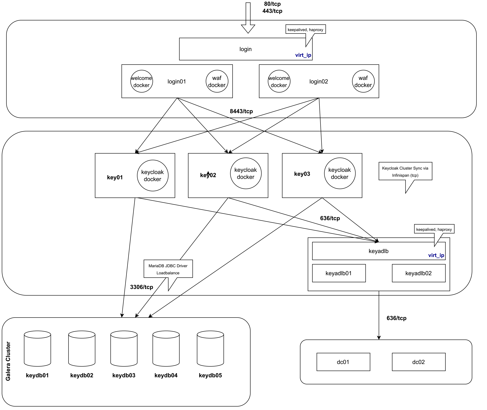

## Technische Architektur

### Überblick

Als neue zentrale Login-Infrastruktur handelt es sich bei unserem Deployment um ein
hochverfügbares Keycloak-Cluster bestehend aus mehreren Komponenten und Erweiterungen,
die im Nachfolgenden näher beschrieben werden.

Die Kommunikation zwischen den einzelnen Netz-Segmenten und Komponenten erfolgt immer verschlüsselt. 
Details zum Anlegen einer eigenen CA für interne Zwecke finden sich [hier](CA.md). Dort findet sich auch eine Übersicht der zu erstellenden Zertifikate für interne Cluster-Kommunikation.

### Login Portal

Keycloak wird an der Hochschule Heilbronn hinter einem 2-Knoten [HAProxy](https://www.haproxy.org/) über eine virtuelle IP-Adresse via [keepalived](https://www.keepalived.org/) bereitgestellt.
Einer der beiden Knoten befindet sich dabei im Standby.

Zusätzlich dazu sind in jeweils einem [Docker](https://www.docker.com/)-Container der zuvor erwähnte Erst-Einrichtungsassistent
sowie eine [Web Application Firewall](https://github.com/jcmoraisjr/modsecurity-spoa) (ebenfalls als Docker-Container) hinterlegt.

#### HAProxy
Der HAProxy ist für [URL-basiertes Rate-Limitting](https://www.haproxy.com/blog/four-examples-of-haproxy-rate-limiting) konfiguriert,
um Zugriffe auf den `authenticate` Endpunkt von Keycloak im Ernstfall zu throtteln.

Die entsprechende Konfiguration des HAProxy findet sich hier: [haproxy.cfg](src/keycloak/cfg/haproxy.cfg). Die entsprechende `rates.map`-Datei findet sich [hier](src/keycloak/cfg/rates.map).

Abweichend zur Standardinstallation verwenden wir auch teilweise customisierte Fehlerseiten. Diese sind unter [/src/keycloak/cfg/errors](/src/keycloak/cfg/errors) zu finden.

#### Web Application Firewall (WAF)

Die Konfiguration des WAF-Containers befindet sich mit der zugehörigen `docker-compose.yml` [hier](src/keycloak/docker-waf) und basiert auf dem Docker-Image von [jcmoraisjr/modsecurity-spoa](https://github.com/jcmoraisjr/modsecurity-spoa).
Das explizite Überschreiben und Einbinden der `modsecurity`-Regelsätze ist notwendig, da gerade im Hochschulumfeld einige
Anwendungen von Drittanbietern existieren, deren Kommunikation mit Keycloak bei Verwendung von Standardregelsätzen in der WAF stecken bleibt.

#### Einrichtungsassistent "Onboarding"

Die Anwendung zur Ersteinrichtung wird ebenfalls als Docker-Container betrieben. Der Source-Code dieser Anwendung befindet sich [hier](https://github.com/hhn/sso-welcome).
Das Deployment erfolgt ebenfalls über eine zugehörige `docker-compose.yml` [hier](src/keycloak/docker-welcome). 

Abweichend zu einem Standardcontainer wird die Anzahl der Worker-Prozesse von `auto` auf `8` gesetzt, um Limitationen von Docker zu umgehen.

### Keycloak

Die Hochschule betreibt einen Verbund aus drei Keycloak-Knoten, die als Docker-Container auf den jeweiligen virtuellen Maschinen betrieben werden.

#### Dockerfile

Neben der oben erwähnten Anpassung an der Cluster-Kommunikation müssen noch andere Anpassungen für den produktiven Betrieb vorgenommen werden.
Unter anderem müssen die entsprechenden Zertifikate für verschlüsselte Kommunikation hinzugefügt werden und entsprechende Konfiguration für den
Betrieb hinter einem HAProxy gesetzt werden.

Da im Falle der Hochschule Heilbronn für die Mitarbeitenden der Verwaltung zudem Client-Zertifkate zur Authentifikation eingesetzt werden sollen,
müssen auch für diesen Sonderfall Einstellungen am Keycloak-Container (und am HAProxy) vorgenommen werden.

Das entsprechende Dockerfile findet sich [hier](src/keycloak/docker-keycloak/Dockerfile).

#### Infinispan Config

Die Cluster-Synchronisation zwischen den einzelnen Knoten erfolgt (abweichend von einer Standard-Installation) über verschlüsselte **tcp** (sonst **udp**) Infinispan-Kommunikation.
Das Infinispan-Konfiguration, die für den Container-Build verwendet wird, findet sich [hier](src/keycloak/docker-keycloak/hhn-infinispan-config.xml).

#### Passwort Ausschlüsse

Neben einer starken Passwort-Policy, die über Active Directory durchgesetzt wird, setzen wir [eine Liste der häufigsten Passwörter](https://github.com/danielmiessler/SecLists/tree/master/Passwords/Common-Credentials) 
als Ausschlussliste ein. Diese muss nach dem Download noch [konvertiert](src/keycloak/docker-keycloak/convert-pw-list.sh) werden und wird dann im Container-Build von Keycloak in das Container-Image eingebaut.

#### Anbindung an Active Directory

Als Quelle für Nutzer und Passwörter dient das Active Directory der Hochschule Heilbronn bestehend aus zwei Knoten.
Zur Vermeidung von Ausfällen (Keycloak unterstützt nur eine einzige Zielurl in seiner Konfiguration) wird auch hier ein
HAProxy in Verbindung mit keepalived als Load-Balancer eingesetzt.

Die entsprechende Konfiguration des HAProxy befindet sich [hier](src/keycloak/cfg/adlb/haproxy.cfg).

#### Datenbank-Verbund

Für die Persistierung der zweiten Faktoren wird ein Galera4 Datenbank Cluster aus 5 Knoten eingesetzt, wovon 3 Knoten aktiv am Keycloak konfiguriert sind.
Die übrigen 2 Knoten dienen zur Auflösung von Split-Brain-Situationen des Clusters oder zur Wiederherstellung.

Die Installation des Galera4 Clusters sowie der entsprechenden TLS/SSL Verschlüsslung für die Kommunikation erfolgt gemäß der offiziellen Dokumentation.

##### Hinweis

Galera benötigt ein **re-hashing** der Zertifikate (für jedes Cluster-Mitglied), d.h. `openssl rehash /etc/my.cnf.d/certificates` ausführen.