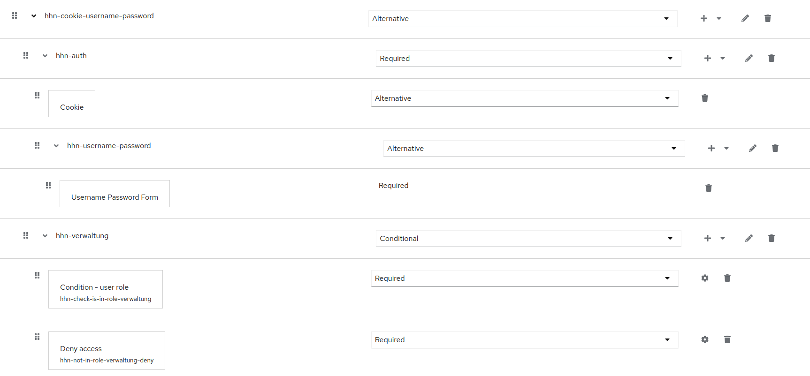

# Keycloak Setup

## Überblick

Als neue zentrale Login-Infrastruktur handelt es sich bei unserem Deployment um ein hochverfügbares Keycloak-Cluster bestehend aus mehreren Komponenten und Erweiterungen, die im Nachfolgenden näher beschrieben werden.

Die Kommunikation zwischen den einzelnen Netz-Segmenten und Komponenten erfolgt immer verschlüsselt. Details zum Anlegen einer eigenen CA für interne Zwecke finden sich [hier](CA.md). Dort findet sich auch eine Übersicht der zu erstellenden Zertifikate für die interne Cluster-Kommunikation.

## Login-Portal

Das Login-Portal der Hochschule Heilbronn besteht aus verschiedenen Komponenten:

1. Dual-Knoten [HAProxy](https://www.haproxy.org/), der über eine virtuelle IP-Adresse via [keepalived](https://www.keepalived.org/) bereitgestellt wird. Der HAProxy ist auch für Rate Limiting verantwortlich. Einer der beiden Knoten befindet sich dabei im Standby.

2. Sämtliche Komponenten werden durch eine [Web Application Firewall](https://github.com/jcmoraisjr/modsecurity-spoa) geschützt, die als Docker-Container betrieben wird.

3. Zusätzlich dazu wird ebenfalls in einem Docker-Container der zuvor erwähnte [Onboarding-Assistent](https://github.com/HHN/sso-welcome) betrieben, eine Webanwendung zur Unterstützung der Accounteinrichtung.

Diese Komponenten werden im nachfolgenden näher beschrieben.

### HAProxy

Der `HAProxy` ist für [URL-basiertes Rate-Limitting](https://www.haproxy.com/blog/four-examples-of-haproxy-rate-limiting) konfiguriert,
um Zugriffe auf den `authenticate` Endpunkt von Keycloak im Ernstfall zu throtteln.

Die entsprechende Konfiguration des `HAProxy` finden sich hier:

* [`haproxy.cfg`](src/keycloak/cfg/haproxy.cfg) mit der zentralen Konfiguration
* [`rates.map`](src/keycloak/cfg/rates.map) zur Konfiguration des Rate Limiting

Abweichend zur Standardinstallation verwenden wir auch teilweise angepasste Fehlerseiten. Diese sind unter [/src/keycloak/cfg/errors](/src/keycloak/cfg/errors) zu finden.

### Web Application Firewall

Zum Schutz vor webbasierten Angriffen, sind Zugriffe auf Keycloak durch eine Web Application Firewall (WAF) geschützt. Die Konfiguration des WAF-Containers befindet sich mit der zugehörigen `docker-compose.yml` [hier](src/keycloak/docker-waf) und basiert auf dem Docker-Image von [jcmoraisjr/modsecurity-spoa](https://github.com/jcmoraisjr/modsecurity-spoa).

Das explizite Überschreiben und Einbinden der `modsecurity`-Regelsätze ist notwendig, da gerade im Hochschulumfeld einige
Anwendungen von Drittanbietern existieren, bei denen die Standardregelsätze zu Kommunikationsfehlern führen können.

### Einrichtungsassistent "Onboarding"

Die Anwendung zur Ersteinrichtung wird ebenfalls als Docker-Container betrieben. Der Source-Code dieser Anwendung befindet sich unter [https://github.com/hhn/sso-welcome](https://github.com/hhn/sso-welcome).
Das Deployment erfolgt ebenfalls über eine zugehörige [`docker-compose.yml`](src/keycloak/docker-welcome).

Abweichend zu einem Standardcontainer wird die Anzahl der Worker-Prozesse von `auto` auf `8` gesetzt, um Limitationen von Docker zu umgehen.

## Keycloak

Die zentrale Komponente des Login-Portals ist ein Verbund aus drei Keycloak-Knoten, die als Docker-Container auf den jeweiligen virtuellen Maschinen betrieben werden. Die Konfiguration von Keycloak wird in den folgenden Abschnitten näher beschrieben.

### Dockerfile

Neben der oben erwähnten Anpassung an der Cluster-Kommunikation müssen noch andere Anpassungen für den produktiven Betrieb vorgenommen werden.
Unter anderem müssen die entsprechenden Zertifikate für verschlüsselte Kommunikation hinzugefügt werden und entsprechende Konfiguration für den
Betrieb hinter einem `HAProxy` gesetzt werden.

Da im Fall der Hochschule Heilbronn zusätzlich Client-Zertifikate zur Authentisierung für Beschäftigte der Verwaltung verwendet werden, müssen auch dafür Einstellungen am Keycloak-Container (und am `HAProxy`) vorgenommen werden.

Das entsprechende Dockerfile findet sich [hier](src/keycloak/docker-keycloak/Dockerfile).

### Infinispan Config

Die Cluster-Synchronisation zwischen den einzelnen Knoten erfolgt (abweichend von einer Standard-Installation) über verschlüsselte **tcp** (sonst **udp**) Infinispan-Kommunikation. Die Infinispan-Konfiguration, die für den Container-Build verwendet wird, findet sich [hier](src/keycloak/docker-keycloak/hhn-infinispan-config.xml).

### Verbotene Passwörter

Neben einer Passwort-Policy, die über Active Directory durchgesetzt wird, verwenden wir [eine Liste der häufigsten Passwörter](https://github.com/danielmiessler/SecLists/tree/master/Passwords/Common-Credentials) als Ausschlussliste. Diese muss nach dem Download noch [konvertiert](src/keycloak/docker-keycloak/convert-pw-list.sh) werden und wird dann im Container-Build von Keycloak in das Container-Image integriert. Zum Thema Passwörter beachten Sie bitte auch die Hinweise in der Onboarding-Anwendung unter [Limitations](https://github.com/hhn/sso-welcome#limitations).

### Anbindung an Active Directory

Als Quelle für Nutzer und Passwörter dient das Active Directory der Hochschule Heilbronn bestehend aus zwei Knoten. Zur Vermeidung von Ausfällen (Keycloak unterstützt nur eine einzige Ziel-URL in seiner Konfiguration) wird auch hier ein `HAProxy` in Verbindung mit `keepalived` als Load-Balancer eingesetzt.

Die entsprechende Konfiguration des `HAProxy` befindet sich [hier](src/keycloak/cfg/adlb/haproxy.cfg).

## Datenbank Backend

Für die Persistierung der zweiten Faktoren wird ein `Galera4` Datenbank Cluster aus 5 Knoten eingesetzt, wovon 3 Knoten aktiv am Keycloak konfiguriert sind. Die übrigen 2 Knoten dienen zur Auflösung von Split-Brain-Situationen des Clusters oder zur Wiederherstellung.

Die Installation des Galera4 Clusters sowie der entsprechenden TLS/SSL Verschlüsslung für die Kommunikation erfolgt gemäß der offiziellen Dokumentation.

### Hinweis

Galera benötigt ein **re-hashing** der Zertifikate (für jedes Cluster-Mitglied), d. h. `openssl rehash /etc/my.cnf.d/certificates` ausführen.

## Konfigurationen innerhalb von Keycloak

### Login-Flow

Für alle Hochschulangehörigen (Beschäftigte und Studierende) erzwingen wir eine Anmeldung mit zwei Faktoren. Als zweite Merkmale unterstützen wir TOTP oder WebAuthn (Passkeys, Yubikeys, etc.).

Beschäftigte in der Verwaltung haben zusätzlich jeweils ein Client-Zertifikat auf ihren Dienstgeräten installiert (die Verteilung erfolgt über andere Wege). Die privaten Schlüssel befinden sich dabei in den TPM-Chips der Dienstgeräte und können somit nicht trivial kopiert oder extrahiert werden. Damit ist sichergestellt, dass Beschäftigte der Verwaltung sich in der Regel ausschließlich von ihrem Dienstgerät aus anmelden können (u. a. am VPN basierend auf eduVPN).

Nachfolgend dargestellt ist der Login-Flow, den wir für einen normalen Login verwenden.

Zu sehen ist, dass entweder der Subflow mit x509 Zertifikaten (Client-Zertifikaten) oder der Subflow mit Benutzername und Passwort durchlaufen werden muss.

Der x509-Subflow erfordert das Vorhandensein eiens Client-Zertifikats.

Der Subflow mit nur Benutzername und Passwort ermöglicht das Einloggen und beendet den Flow für Verwaltungsbeschäftigte.

Die Modellierung mit "Deny Access" wurde explizit gewählt, um selbstdefinierte und internationalisierte Fehlermeldungen ausgeben zu können.

Unabhängig von der vorigen Anmeldung wird ein zweiter Faktor gefordert, falls das aktuelle "Level of Authentication" noch nicht erreicht ist.

Auch hier wurde explizit eine Modellierung mit "Deny access" gewählt, um den Nutzer darauf hinzuweisen, dass er noch keinen zweiten Faktor hinterlegt hat und erläutert, wo er dies nachholen kann.

In der Onboarding-Anwendung wird eine leicht modifizierte Version des beschriebenen Ablaufs verwendet, die es Benutzern ohne zweiten Faktor ermöglicht, sich anzumelden, um dann einen zweiten Faktor zu hinterlegen. Bei der Anmeldung via Onboarding ohne zweiten Faktor wird das "Level of Authentication" niedriger gesetzt, so dass die Anmeldung ohne MFA nicht ausreichend ist, um weitere Dienste nutzen zu können.