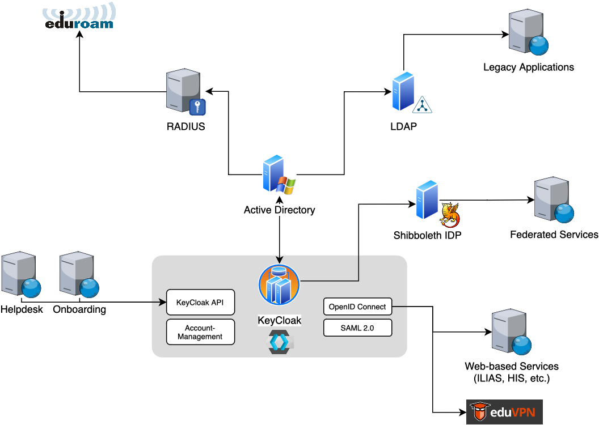

# Single-Sign-On (SSO) an der Hochschule Heilbronn

Dieses Repository bietet eine Einführung in unsere auf [Keycloak](https://www.Keycloak.org/) basierende SSO-Lösung an der [Hochschule Heilbronn](https://www.hs-heilbronn.de). Das Gesamtsystem befindet sich seit Anfang 2023 im produktiven Einsatz für über 8.000 Studierende und 800 Beschäftigte.

## Motivation

Aufgrund eines Cyberangriffs mussten wir große Teile unserer IT-Infrastruktur neu aufbauen und in diesem Zuge auch die Passwörter aller Hochschulangehörigen zurücksetzen. In dieser neuen Umgebung ist das Active Directory das führende System zur Speicherung der Account-Informationen. Passwörter werden nur dort gespeichert (keine Repliken auf LDAP-Servern o. ä.). Als "Frontend" dafür haben wir uns für die Identity und Access Management Lösung [Keycloak](https://www.keycloak.org/) entschieden.

In diesem Respository stellen wir alle Informationen und Konfigurationen für den Betrieb dieser Umgebung zur Verfügung.

### Warum Keycloak?

* Keycloak ist Open Source.
* Keycloak kann Active Directory als Datenquelle nutzen.
* Keycloak bietet ein webbasiertes Account Management. Über dieses Self-Service-Portal können Nutzer z. B. ihr Passwort ändern, ihre Zweitfaktoren verwalten oder aktive Sessions einsehen.
* Keycloak ermöglicht Multi-Faktor-Authentifizierung (MFA) über zeitbasierte Einmal-Token (TOTP) oder FIDO2 (Hardware-Keys, Passkeys, etc.).
* Keycloak unterstützt moderne Authentifizierungsverfahren wie OpenID Connect (OIDC) oder SAML 2.0, mit denen ein Single Sign-On für *alle* webbasierten Dienste realisiert werden kann. Über [eduVPN](https://www.eduvpn.org) werden auch VPN-Logins per Single Sign-On realisiert und per MFA geschützt.
* Keycloak erleichtert das "Onboarding" beim Passwort-Rollout.
* Keycloak kann dem Shibboleth Identity Provider (IDP) transparent "vorgeschaltet" werden. Damit ist auch der Zugriff auf föderierte Dienste (bwIDM) per Single Sign-On möglich und automatisch per MFA geschützt, ohne dass der IDP dafür aufwändig angepasst werden muss.

### Warum Single Sign-On?

Mit Single Sign-On werden Zugangsdaten künftig nur noch an einer zentralen Stelle in unserem Keycloak-basierten "Login-Portal" eingegeben. Daraus ergeben sich mehrere Vorteile:

* Die einzelnen Anwendungen erhalten nicht mehr die Klartext-Passwörter der Nutzer, sondern nur noch einen temporären Login-Token, der vom Login-Portal ausgegeben wird. Dadurch sinkt das Risiko der Kompromittierung von Hochschulzugangsdaten gegenüber z. B. LDAP-basierten Verfahren.
* Am Login-Portal kann eine starke Authentifizierung über zwei Faktoren erzwungen werden.
* Am Login-Portal kann ein Monitoring aller Anmeldevorgänge erfolgen, um zukünftige identitätsbasierte Angriffe schneller erkennen und verfolgen zu können.
* Am Login-Portal kann an zentraler Stelle ein Brute-Force-Schutz implementiert werden (z.B. Throttling und ggf. IP-Blocking).
* Das Risiko von Phishing-Angriffen sinkt, da Nutzer zukünftig dazu angehalten werden können, ihre Zugangsdaten nur noch im offiziellen Login-Portal einzugeben. Durch geeignete Zweitfaktoren (FIDO2) kann das Phishing-Risiko eliminiert werden.
* Gleichzeitig steigt der Komfort für Nutzer, da sie sich nur noch einmal am Login-Portal stark authentifizieren müssen und dann ohne weitere Anmeldungen auf die dort angebundenen Anwendungen zugreifen können (Single Sign-On).

### Warum dieses Projekt?

Auf diesen Seiten stellen wir alle Informationen zu unserer Keycloak-Installation zur Verfügung. Unser Ziel ist es, anderen Hochschulen die Möglichkeit zu geben, dieses Setup zu evaluieren und ggf. zu implementieren.

Neben Architekturbeschreibungen und Anleitungen stellen wir auch Docker- und Konfigurationsdateien zur Verfügung. Diese beinhalten z. B. das Setup von Keycloak selbst, aber auch Konfigurationsdateien für einen hochverfügbaren Clusterbetrieb oder zusätzliche Sicherheitsmaßnahmen wie einen Brute-Force-Schutz und den Schutz durch eine Web Application Firewall. Darüber hinaus beschreiben wir, wie Keycloak in Verbindung mit Shibboleth IDP (bwIDM) betrieben werden kann.

Darüber hinaus stellen wir den Quellcode von zwei eigenentwickelten Anwendungen als Open Source zur Verfügung:

* [**Onboarding**](https://github.com/hhn/sso-welcome): Die Onboarding-Anwendung hilft bei der Ersteinrichtung neuer Konten. Nutzer werden zunächst aufgefordert, sich mit ihrem Initialpasswort anzumelden. Anschließend werden sie von einem Assistenten durch die Aktivierung ihres neuen Hochschulkontos geführt. Dabei wird unter anderem ein neues sicheres Passwort konfiguriert, Notfallwiederherstellungscodes generiert und ein zweiter Faktor (TOTP oder FIDO2) registriert. Im Hintergrund kommuniziert die Anwendung mit der Keycloak API. Diese Anwendung haben wir bei unserem Passwort-Rollout eingesetzt und setzen sie auch heute noch für neue Mitarbeitende und Studierende ein. Mittlerweile haben über 10.000 Personen ihr neues Hochschulkonto darüber in Betrieb genommen. Die Welcome- bzw. Onboarding-Anwendung ist über https://login.hs-heilbronn.de öffentlich erreichbar.

* [**Helpdesk**](https://github.com/hhn/sso-helpdesk): Die Helpdesk-Anwendung unterstützt das Zurücksetzen von Passwörtern in Helpdesk-Situationen. Dazu werden Passwort-Reset-Briefe mit zufälligen Passwörtern vorgeneriert, ausgedruckt und kuvertiert am Helpdesk bereitgestellt. Im Sichtfenster befindet sich ein QR-Code mit einer fortlaufenden Nummer. Nach erfolgter Identitätsfeststellung (Ausweisprüfung) wird über die Helpdesk-Anwendung das betroffene Nutzerkonto ausgewählt und der QR-Code gescannt. In diesem Moment wird das Konto auf das im Brief enthaltene Passwort zurückgesetzt. Im Hintergrund kommuniziert die Anwendung mit der Keycloak API. Über alle Aktivitäten wird ein Audit-Log erstellt, so dass am Ende des Tages die Unterschriftenlisten im Helpdesk mit dem Audit-Log über die dokumentierten Passwort-Resets abgeglichen werden können.

## Gesamtüberblick

Active Directory ist das führende System zur Speicherung von Account-Informationen. Keycloak ist das "Frontend" dazu und bietet eine webbasierte Account-Verwaltung, Multi-Faktor-Authentifizierung, Single Sign-On und eine umfassende API, die u. a. von den Onboarding/Helpdesk-Anwendungen genutzt wird.

Daneben gibt es noch einige andere Authentifizierungssysteme:

* LDAP-Server: Einige Legacy-Anwendungen benötigen noch eine Anmeldung über LDAP. Solche Anwendungen unterstützen bisher weder OIDC noch SAML2.0. Für eine Übergangszeit erlauben wir die Nutzung, fordern aber von den Systemverantwortlichen ein Sicherheitskonzept. Die LDAP-Server replizieren keine Passwörter und sind direkt mit dem Active Directory verbunden.

* RADIUS-Server: [eduroam](https://eduroam.org) nutzt IEEE 802.1X zur Authentifizierung von WiFi-Clients auf Basis von RADIUS. Dazu betreiben wir derzeit RADIUS-Server basierend auf OpenRADIUS, die das Active Directory als Quelle nutzen. Perspektivisch wollen wir auf [easyroam](https://doku.tid.dfn.de/de:eduroam:easyroam) umsteigen und die Anmeldevorgänge dann auch über das Login-Portal abwickeln.

* Shibboleth IDP: Für die Teilnahme an föderierten Diensten (z. B. bwIDM) betreiben Hochschulen in der Regel Identity Provider auf Basis von [Shibboleth](https://www.shibboleth.net/). Wir haben den IDP "hinter" Keycloak geschaltet, so dass Anmeldevorgänge immer transparent über unser Login-Portal erfolgen. Damit sind auch föderierte Zugänge per Single Sign-On (inkl. MFA, Monitoring, etc.) abgesichert, ohne dass der Shibboleth IDP dafür aufwändig angepasst werden muss.

## Passwort-Rollout

Aufgrund eines Cyberangriffs mussten wir große Teile unserer IT-Infrastruktur neu aufbauen und in diesem Zuge auch die Passwörter aller Hochschulangehörigen zurücksetzen. Wir haben neue Domänencontroller installiert, darin Konten für alle Hochschulangehörigen (Studierende und Beschäftigte) eingerichtet und Initialpasswörter vergeben. Die Initialpasswörter bestanden aus einer zufälligen Zeichenfolge, gefolgt vom Geburtsdatum der Person. Diese Initialpasswörter wurden an Studierende per Postbrief an die Heimatanschrift verschickt. Beschäftigte haben die Initialpasswörter per Brief, gemeinsam mit [Yubikeys](https://www.yubico.com/), vor Ort erhalten.

* [Anschreiben mit Initialpasswort](./resources/Anschreiben_Initialpasswort.docx) (Muster)

Die Ersteinrichtung der Accounts erfolgte dann über unsere eigenentwickelte "Onboarding"-Anwendung (siehe oben). Die nachfolgenden Videos zeigen die Anwendung und das Onboardung für Studierende sowie für Beschäftigte.

* https://youtu.be/XtUYZPxLRg8 (Onboarding für Studierende)
* https://youtu.be/yK5jxKleMaE (Onboarding für Beschäfitgte mit Yubikeys)

## Technische Beschreibungen

Auf den nachfolgenden Seiten finden Sie detaillierte Beschreibungen zum Setup der Umgebung. Im [`src`](./src/) Ordner finden sich zudem alle relevanten Konfigurationsdateien:

- Setup von [Keycloak](./Keycloak.md), einschließlich Customizing, Load Balancing, Rate Limiting, Web Application Firewall
- Setup eines [Galera4 Datenbank Cluster](./Galera4.md)
- Setup einer [eigenen Certificate Authority](./CA.md) zur Absicherung der internen Kommunikation
- Anbindung von [Keycloak an den Shibboleth IDP](./IdP.md)